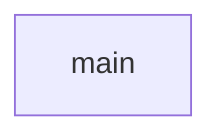

# chapter-9
jacob

##  Description
lets the user shift the alphabet however mush they want

###  Flowchart

#### Function Diagrams

|  main   |               |    Jacob  |
| ------------------ | ------------- | ------------ |
|  no arguments   | Main calls all functions to build the program  |           |  
***
|   get_shift  |               |    Jacob    |
| ------------------ | ------------- | ------------ |
| no arguments   |Prompts the user for the shift value as a string, validates for 1-25 inclusive.  |   returns a string           |

***
|   choose_option  |               |    Jacob    |
| ------------------ | ------------- | ------------ |
|  no arguments  |  Ask to user if they want to encode/decode, returns True if they want to encode, and False if they want to decode |    returns boolean variable       |

***
|  get_message   |               |   Gage     |
| ------------------ | ------------- | ------------ |
| recieves no arguments    | get_message should prompt the user to enter a message to encode or decode.  It should return that message  |         returns message as a string     |
***
|  create_key   |               |  Gage      |
| ------------------ | ------------- | ------------ |
| recieves argument from get_shift    |   It should create the caesar cipher according to the shift value and store the key in a dictionary and return the dictionary as the key |   returns dictionary as a key  |       
***
|   encode  |               |    Jacob    |
| ------------------ | ------------- | ------------ |
|  recieves message, and key   |  It should encode the message using the key and return the encoded message as a string  |  returns encoded string            |
***
|  decode   |               |     Gage   |
| ------------------ | ------------- | ------------ |
|     recieves message and key| It should decode the message using the key and return the decoded message as a string  |      returns decoded string        |
***
