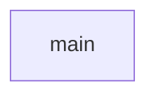

# chapter-9
jacob, gage

##  Description
lets the user shift the alphabet however mush they want

###  Flowchart

#### Function Diagrams

|  main   |               |      |
| ------------------ | ------------- | ------------ |
|     |  |           |  
***
|   get_shift  |               |        |
| ------------------ | ------------- | ------------ |
|    |  |              |

***
|   choose_option  |               |        |
| ------------------ | ------------- | ------------ |
|    |   |              |

***
|  get_message   |               |        |
| ------------------ | ------------- | ------------ |
|     |   |              |
***
|  create_key   |               |        |
| ------------------ | ------------- | ------------ |
|     |   |     |       
***
|   encode  |               |        |
| ------------------ | ------------- | ------------ |
|     |   |              |
***
|  decode   |               |        |
| ------------------ | ------------- | ------------ |
|     |   |              |
***
